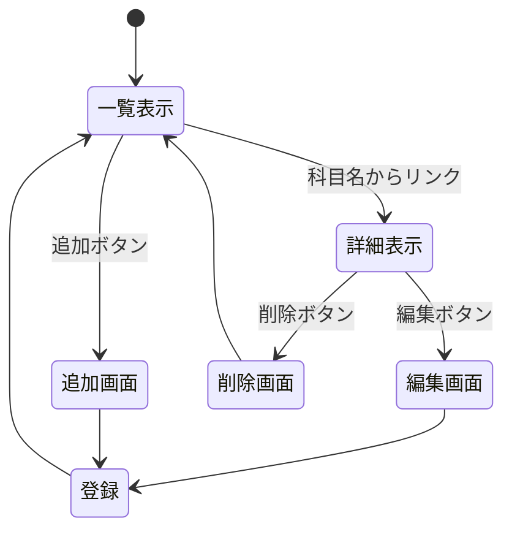

# 開発者用仕様書（仮）

仮で情報工専門科目一覧とする

## 1.はじめに
この仕様書は，「情報工専門科目一覧」の開発者向けのものである

## 2.仕様

### 2.1 データ構造
扱うデータ
科目名，担当者，場所，個人的難易度，評価方法
### 2.2 ページ遷移
  ##### どうやってページ遷移するか？（ページ内のリンク，駅名をクリックなど）

  ##### HTTPメソッドとリソース名
  

  ##### 追加・削除・編集後に表示する内容

### 2.3 リソースごとの機能の詳細