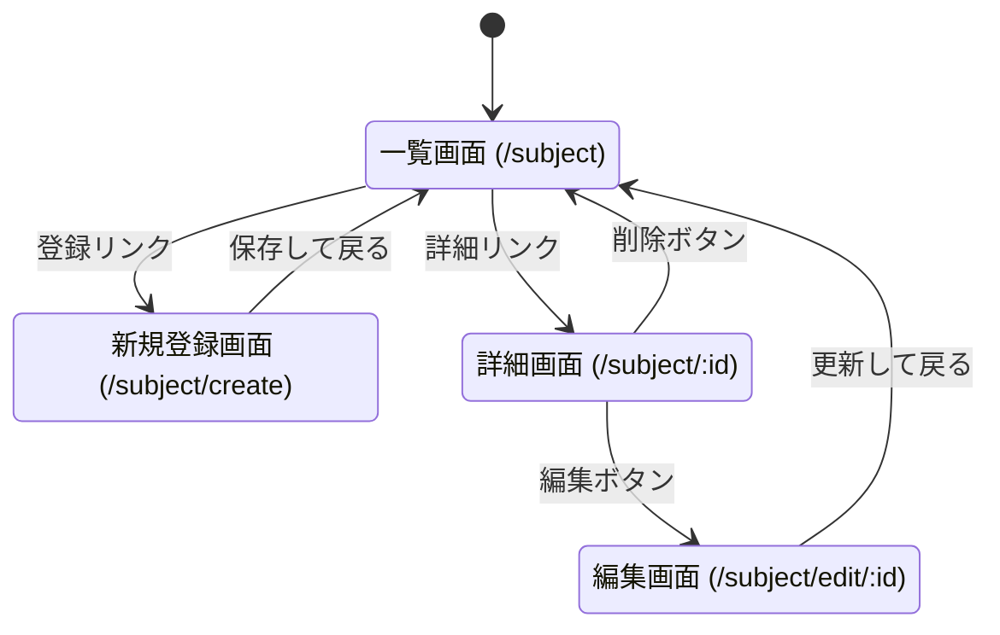

```mermaid
stateDiagram-v2
    direction TB
    
    state "一覧画面 (/subject)" as List
    state "新規登録画面 (/subject/create)" as Create
    state "詳細画面 (/subject/:id)" as Detail
    state "編集画面 (/subject/edit/:id)" as Edit

    %% メインの流れ
    [*] --> List
    
    %% 登録の流れ
    List --> Create : 登録リンク
    Create --> List : 保存して戻る

    %% 詳細・編集の流れ
    List --> Detail : 詳細リンク
    Detail --> Edit : 編集ボタン
    Edit --> List : 更新して戻る

    %% 削除の流れ
    Detail --> List : 削除ボタン
```